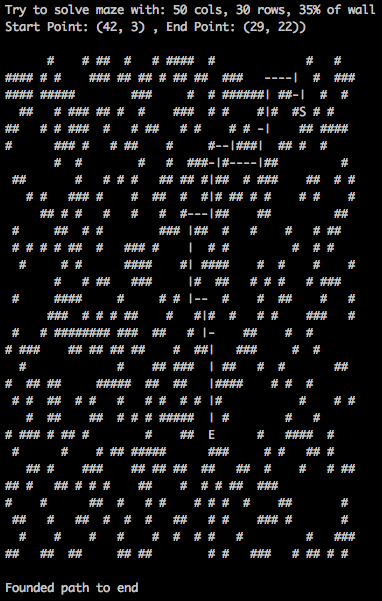

# Maze

Generate maze with n x m dimension, than try to find a path from random start end random goal, after that draw maze and path if exist into the shell.

## How to use

Clone the repository:

```bash
git clone https://github.com/delbio/maze
```

Project is usable via cli or in interactive mode.

### Via CLI

```bash
python3 Main.py 50 30 .35
```

### Via interactive python shell

open python 3 interpreter into root of project, than write into console this code:

```python
from Main import maze


maze(50, 30, .35)
```

## Output


